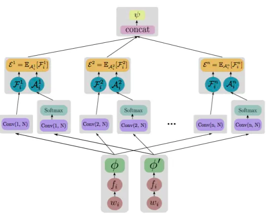
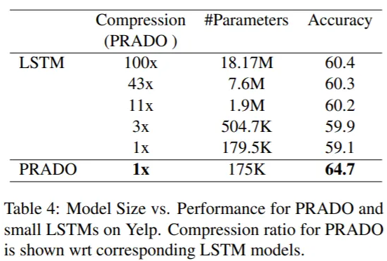
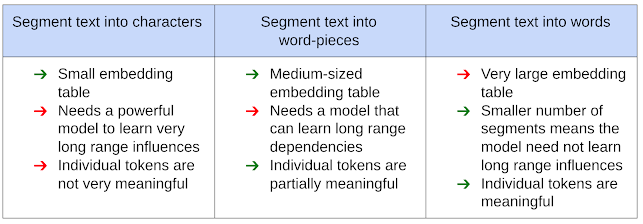
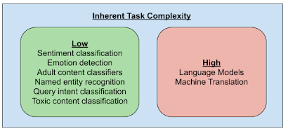
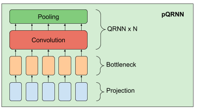
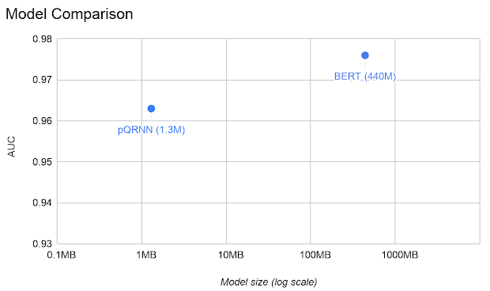

# pQRNND

> 【新智元导读】近日，谷歌推出了新模型「pQRNN」，它是由去年推出的「PRADO」进一步使用小模型改进而得，达到了SOTA结果。pQRNN的新颖之处在于，它可以结合一个简单的映射和一个quasi-RNN编码器来进行快速并行处理。同时，谷歌证明了该模型能在参数较少的情况下进行文本分类任务，并达到BERT级别的性能表现。

深层神经网络的快速发展在过去的十年中彻底改变了自然语言处理(NLP)领域 。同时，诸如保护用户隐私、消除网络延迟、启用离线功能以及降低运营成本等问题，迅速推动了可以在移动设备而不是在数据中心运行的 NLP 模型的发展。

然而，因为移动设备的内存和处理能力有限，这就要求运行在移动设备上的模型体积小、效率高，而且不影响其结果的质量。

 

去年，谷歌发表了一个名为「PRADO」的神经结构，使用一个参数量小于200K 的模型，在许多文本分类问题上取得了SOTA的结果。虽然大多数模型对每个token使用固定数量的参数，但是 PRADO 模型使用的网络结构需要极少的参数来学习任务最相关或最有用的token。

## PRADO是如何工作的

在一年前开发时，PRADO 利用了 NLP 领域特有的文本分割来减少模型的大小并提高性能。

图：PRADO的模型结构

PRADO和LSTM在Yelp数据集上的对比

通常，NLP 模型的文本输入首先被处理成适合输入神经网络的形式，将文本分割成与预定义的通用字典(包含所有可能的token列表)中的值相对应的Segment。

 

然后，神经网络使用可训练的参数惟一地识别每个Segment，该参数包括Embedding table。然而这种利用文本分割的方式对模型的性能、大小和延迟有很大的影响。

 

下图显示了使用各种的方法及其优缺点：

由于文本片段的数量是模型性能和压缩的一个重要参数，从而产生了一个问题: NLP 模型是否需要能够清楚地识别每一个可能的文本片段。为了回答这个问题，谷歌还研究了 NLP 任务的内在复杂性。

 

只有少数 NLP 任务(例如语言模型和机器翻译)需要知道文本片段之间的细微差别，因此需要能够唯一地识别所有可能的文本片段。相比之下，其他大多数任务可以通过了解这些片段的一个小子集来解决。

 

此外，与任务相关的片段的子集可能不是最常见的片段，如 a，an，the 等，这对于许多任务来说是无用的片段。因此，允许网络为给定的任务确定最相关的部分可以带来更好的性能。

 

此外，模型不需要能够唯一地识别这些片段，只需要识别文本片段的簇。例如，情感分类器只需要知道与文本中的情感密切相关的簇即可。

利用这些发现，PRADO 被设计用来学习来自单词而不是单词片段或字符的文本片段簇，这使它能够在低复杂度的 NLP 任务中取得良好的表现。由于单词粒度更有意义，而且对于大多数任务来说最相关的单词数量很少，所以学习这样一个相关单词构成的子集所需的模型参数就少得多。

## pQRNND:改进PRADO

在 PRADO 成功的基础上，我们提出了一种改进的NLP模型 pQRNN。该模型由三个构建块、一个将文本中的token转换为三元向量序列的投影算子、一个稠密的bottleneck层和一堆 QRNN 编码器组成。

 

pQRNN 中投影层的实现与 PRADO 中使用的相同，并帮助模型学习最相关的tokens，而不需要使用一组固定的参数来定义它们。它首先在文本中标记出tokens，并使用一个简单的映射函数转换成三元特征向量。

 

这使得这个三元向量序列具有平衡的对称分布并且可以唯一地表示文本。这种表示并不直接有用，因为它没有解决所关心的任务所需的任何信息，而且网络也无法控制这种表示。

 

我们将它传入一个密集的bottleneck层，使网络能够学习与当前的任务相关的单词表示法，但bottleneck层产生的表示仍然没有考虑到单词的上下文。

 

接下来通过使用一堆双向 QRNN 编码器来学习上下文表示，其结果就是使得网络能够从没有经过预处理的输入文本中学习到上下文表示。

## pQRNN的性能表现

作者在civil-comments数据集上对 pQRNN 进行评估，并在同一任务上与 BERT 模型进行比较。

 

简单地说，因为模型大小与参数数目成正比，故pQRNN参数比 BERT 小得多。此外，pQRNN 是量化处理过的，进一步减少了4倍的模型大小。

 

公开训练的 BERT 版本在这项任务上表现不佳，因此将其与通过几个不同相关多语种数据源预训练后的BERT版本进行比较，以获得尽可能好的性能。

## 结论：轻量级文本分类神器

通过使用上一代模型PRADO证明了它可以作为下一代最先进的轻量级文本分类模型的基础。改进后的pQRNN模型表明这种新的体系结构几乎可以达到BERT级的性能，尽管只使用1/300的参数量和有监督的数据。

 

为了促进这一领域的进一步研究，谷歌现在已经开源了 PRADO 模型，并鼓励社区使用它作为新模型架构的起点。
